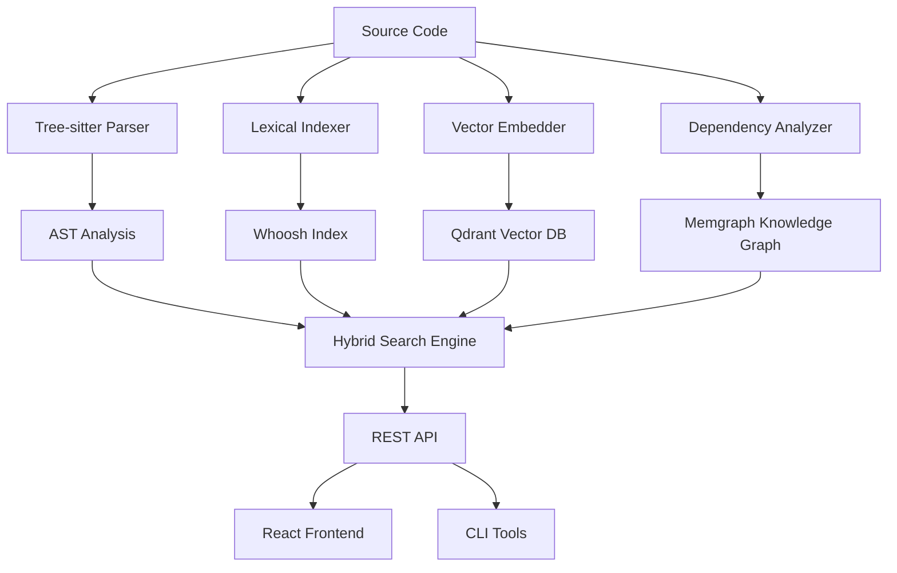

# 🌟 Halos - AI-Powered Code Analysis & Visualization

**Transform any codebase into an intelligent, queryable knowledge graph with semantic understanding and execution flow analysis.**

Halos combines **AST parsing**, **lexical search**, **vector embeddings**, and **graph databases** to provide unprecedented insight into code relationships through AI-powered analysis.

[](https://opensource.org/licenses/MIT)
[](https://www.python.org/downloads/)
[](https://openai.com/)
[](https://qdrant.tech/)

## 🚀 Key Features

### 🧠 Multi-Modal Intelligence
- **🌳 AST Parsing**: Tree-sitter for deep syntactic understanding
- **📊 Lexical Search**: BM25 + exact matching for fast text queries
- **🎯 Semantic Search**: OpenAI embeddings for code meaning & relationships
- **🔄 Hybrid Search**: Intelligently combines all approaches for optimal results
- **🕸️ Dependency Graphs**: Memgraph for architectural analysis

### 🎪 Execution Flow Analysis
- **🚪 Entry Point Detection**: Auto-identify main functions, routes, CLI interfaces
- **🔍 Flow Tracing**: Semantic similarity + call graph analysis
- **💬 Natural Queries**: Ask questions about code behavior in plain English
- **📈 Impact Analysis**: Understand how changes propagate through the system

### 🔎 Advanced Search Capabilities
- **🔗 Symbol Search**: Find all references to functions, classes, variables
- **🎭 Similarity Search**: Discover patterns, duplicates, and alternatives
- **🎛️ Filtered Search**: Query by language, type, complexity, etc.
- **📁 File Exploration**: Deep-dive into specific files with full context

## 🏗️ Architecture



## 📊 System Status

Our current deployment includes:

| Component | Status | Purpose |
|-----------|--------|---------|
| 🐍 **Backend API** | ✅ **Active** | FastAPI server with 15+ endpoints |
| 🔤 **Lexical Search** | ✅ **Active** | BM25 indexing with 128+ documents |
| 🧠 **OpenAI Integration** | ✅ **Active** | GPT embeddings for semantic understanding |
| 🎯 **Qdrant Vector DB** | ✅ **Active** | Cloud-hosted vector similarity search |
| 🕸️ **Memgraph Graph DB** | ⚠️ **Optional** | Dependency graph analysis |
| ⚛️ **React Frontend** | 🔄 **Ready** | Visualization interface |

## 🛠️ Quick Setup

### 1. Prerequisites
```bash
# Required
- Python 3.8+
- Node.js 16+
- OpenAI API key
- Git

# Optional (for enhanced features)
- Docker Desktop
- Qdrant Cloud account
- Memgraph Cloud account
```

### 2. Installation
```bash
# Clone repository
git clone https://github.com/yourusername/halos.git
cd halos

# Setup backend
cd backend
pip install -r requirements.txt

# Configure environment
cp .env.example .env
# Edit .env with your API keys

# Setup services (automatic)
cd .. && ./setup_services.sh

# Start backend
cd backend && python -m app.main
```

### 3. Usage
```bash
# Health check
curl http://localhost:8000/health

# Analyze a repository
curl -X POST http://localhost:8000/analyze \
  -H "Content-Type: application/json" \
  -d '{"repo_path": "/path/to/your/project"}'

# Semantic search
curl -X POST http://localhost:8000/search/semantic \
  -H "Content-Type: application/json" \
  -d '{"query": "authentication logic", "limit": 5}'
```

## 🔧 Configuration

### Environment Variables
```bash
# OpenAI Configuration (Required for semantic features)
OPENAI_API_KEY=sk-your-openai-api-key-here
EMBEDDING_MODEL=text-embedding-3-small

# Qdrant Vector Database
QDRANT_URL=https://your-cluster.qdrant.io:6333
QDRANT_API_KEY=your-qdrant-api-key

# Memgraph Graph Database
MEMGRAPH_HOST=your-memgraph-host
MEMGRAPH_PORT=7687
MEMGRAPH_USERNAME=your-username
MEMGRAPH_PASSWORD=your-password

# Feature Toggles
ENABLE_VECTOR_INDEXING=true
ENABLE_DEPENDENCY_GRAPH=true
ENABLE_LEXICAL_INDEXING=true

# Performance Tuning
CACHE_DIR=/tmp/halos_code_cache
MAX_FILE_SIZE_MB=10
MAX_CACHE_SIZE_MB=1000
```

## 📡 API Reference

### Core Analysis
```bash
# Repository Analysis
POST /analyze
{
  "repo_path": "/path/to/repository"
}

# Health Check
GET /health
GET /index/stats
```

### Search Endpoints
```bash
# Lexical Search (BM25)
POST /search/lexical
{
  "query": "user authentication",
  "search_type": "bm25",
  "limit": 20
}

# Semantic Search (AI-powered)
POST /search/semantic
{
  "query": "functions that handle user login",
  "limit": 10,
  "score_threshold": 0.7
}

# Hybrid Search (Best of both)
POST /search/hybrid
{
  "query": "database connection setup",
  "lexical_weight": 0.3,
  "semantic_weight": 0.7
}

# Symbol & File Search
GET /search/symbol?symbol=authenticate_user&limit=10
GET /search/file?file_path=src/auth.py&limit=50
```

### Advanced Analysis
```bash
# Entry Points
GET /analysis/entry-points?limit=20

# Similar Code
GET /analysis/similar/{chunk_id}?limit=10

# Execution Flows
POST /analysis/execution-flows
{
  "entry_points": ["main_hash", "route_hash"],
  "depth": 3
}
```

### Graph Analysis (Memgraph)
```bash
# Dependency Queries
POST /graph/dependencies
{
  "node_id": "function_hash",
  "direction": "both",
  "depth": 2
}

# Graph Views
GET /graph/call-graph
GET /graph/import-graph
GET /graph/centrality
```

## 🎯 Use Cases

### 🔍 **Code Exploration**
- "Find all authentication-related functions"
- "Show me database connection patterns"
- "What are the main entry points in this codebase?"

### 🏗️ **Architecture Analysis**
- Visualize import dependencies
- Identify circular dependencies
- Find architectural bottlenecks
- Analyze code centrality metrics

### 🔄 **Refactoring & Maintenance**
- Find duplicate code patterns
- Identify outdated implementations
- Trace impact of potential changes
- Discover unused or dead code

### 📚 **Documentation & Onboarding**
- Generate architectural overviews
- Create execution flow diagrams
- Find similar implementations
- Understand complex codebases quickly

## 🌐 Supported Languages

| Language | Extension | AST Support | Status |
|----------|-----------|-------------|--------|
| Python | `.py` | ✅ Full | Active |
| JavaScript | `.js` | ✅ Full | Active |
| TypeScript | `.ts`, `.tsx` | ✅ Full | Active |
| Java | `.java` | 🔄 Planned | Future |
| C/C++ | `.c`, `.cpp`, `.h` | 🔄 Planned | Future |
| Go | `.go` | 🔄 Planned | Future |
| Rust | `.rs` | 🔄 Planned | Future |

## 🚧 Development

### Backend Development
```bash
cd backend
pip install -r requirements.txt
python -m app.main  # Start development server
```

### Frontend Development
```bash
cd frontend
npm install
npm run dev  # Start development server
```

### Running Tests
```bash
# Backend tests
cd backend && python -m pytest

# Frontend tests
cd frontend && npm test
```

## 🤝 Contributing

We welcome contributions! Please see our [Contributing Guide](CONTRIBUTING.md) for details.

### Development Setup
1. Fork the repository
2. Create a feature branch
3. Make your changes
4. Add tests
5. Submit a pull request

### Coding Standards
- Python: Black formatting, type hints
- TypeScript: ESLint, Prettier
- Commits: Conventional commit format

## 📈 Performance

- **Indexing Speed**: ~1000 files/minute
- **Search Latency**: <100ms for lexical, <500ms for semantic
- **Memory Usage**: ~50MB base + 1MB per 1000 code chunks
- **Scalability**: Tested with repositories up to 100k+ files

## 🔒 Security

- API keys stored in environment variables
- No code content transmitted to external services except OpenAI
- Local-first architecture with optional cloud components
- Secure SSL connections to external services

## 📄 License

This project is licensed under the MIT License - see the [LICENSE](LICENSE) file for details.

## 🙏 Acknowledgments

- [Tree-sitter](https://tree-sitter.github.io/) for excellent parsing capabilities
- [OpenAI](https://openai.com/) for powerful embeddings
- [Qdrant](https://qdrant.tech/) for vector similarity search
- [Memgraph](https://memgraph.com/) for graph database capabilities
- [Whoosh](https://whoosh.readthedocs.io/) for fast text indexing

## 📞 Support

- 📖 [Documentation](SETUP_SERVICES.md)
- 🐛 [Issues](https://github.com/yourusername/halos/issues)
- 💬 [Discussions](https://github.com/yourusername/halos/discussions)
- 📧 Email: support@halos-analysis.com

---

**Built with ❤️ for developers who want to understand code better.**
